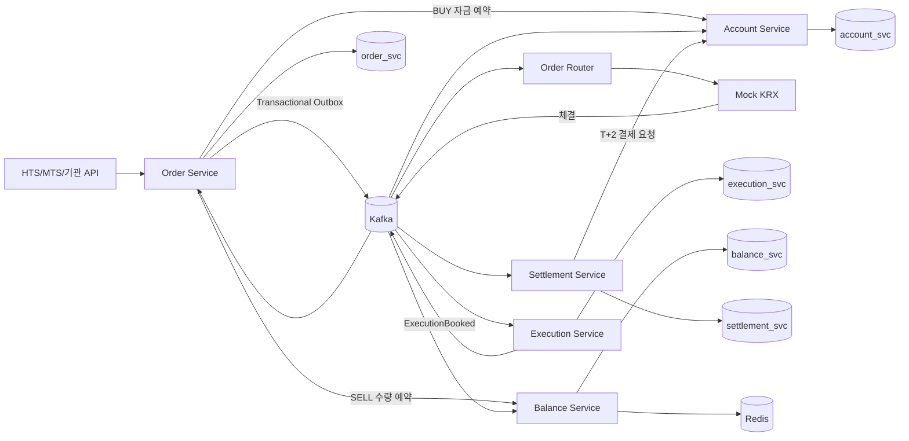

# Domestic Stock Trading System

국내 주식의 **계좌(Account) · 주문(Order) · 정정/취소 · 체결(Execution) · 잔고(Balance) · D+2 정산(Settlement)** 을 하나의 이벤트 기반 백엔드 시스템으로 구성한 Kotlin/Spring Boot 멀티모듈 프로젝트입니다.

이 저장소는 디렉터리 구조만 있는 Skeleton이 아니라 주문 접수부터 Mock KRX 체결, 잔고 반영, 정산예정금 생성, D+2 결제까지 이어지는 비즈니스 로직을 포함합니다. 실제 KRX 규정/프로토콜을 복제한 시스템은 아니며 시장시간, 호가단위, 증거금, 체결 알고리즘은 학습·포트폴리오용 Mock 정책입니다.

---

## 1. 기술 스택

- Kotlin / Java 21 / Spring Boot 3.x
- Spring Web, Validation, Data JPA, Kafka, Redis
- PostgreSQL / Redis / Kafka
- Docker / Kubernetes(EKS) / ArgoCD / Terraform
- OpenTelemetry / Prometheus / Grafana / ELK
- Kotest / JUnit / JaCoCo / Testcontainers
- k6

---

## 2. 전체 비즈니스 흐름



### 정상 BUY 흐름

```text
1. 계좌 Seed
2. BUY 주문 접수
3. Account Service가 주문금액/증거금/신용한도 검증 후 자금 예약
4. Order + Outbox를 동일 DB Transaction으로 저장
5. Kafka ORDER_PLACED 발행
6. Order Router가 시장 세션 검증 후 Mock KRX로 전달
7. Mock KRX가 부분/완전 체결
8. Execution Service가 executionId 기준 멱등 저장
9. ExecutionBookedEvent 발행
10. Order Service 누적체결수량 갱신
11. Balance Service 보유수량/평균단가 갱신
12. Account Service 주문 예약금을 'D+2 정산 보류금'으로 전환
13. Settlement Service가 체결별 T+2 영업일 의무 생성
14. 결제일 도래 시 Account Service에 결제 요청
15. 매수: 예수금 차감/신용 사용 확정
16. 매도: 정산예정금이 예수금으로 전환
```

---

## 3. 모듈 구조

```text
stock-trading-system/
├── libs/
│   ├── common-domain/
│   └── common-event/
├── services/
│   ├── order-service/
│   ├── order-router/
│   ├── mock-krx/
│   ├── execution-service/
│   ├── balance-service/
│   ├── account-service/
│   └── settlement-service/
├── load-test/k6/
├── infrastructure/
│   ├── kubernetes/
│   ├── monitoring/
│   ├── terraform/
│   └── argocd/
├── scripts/
├── docs/
└── docker-compose.yml
```

| 모듈 | 책임 |
|---|---|
| `order-service` | 주문 생성, 정정, 취소, 상태 전이, Outbox |
| `order-router` | 시장 세션 판정, KRX 요청 라우팅 |
| `mock-krx` | Mock 주문 접수, 부분/완전 체결, 정정/취소 경합 |
| `execution-service` | 체결 원장, executionId 멱등성, 체결 Outbox |
| `balance-service` | 보유수량, 매도 예약, 평균매입가, 실현손익 |
| `account-service` | 예수금, 증거금, 신용, 주문가능금액, D+2 보류금 |
| `settlement-service` | 체결별 T+2 결제일, 정산예정금, 결제 완료/미수 상태 |

---

# 4. Hexagonal Architecture

도메인 객체는 Spring, JPA, Kafka, Redis, HTTP를 직접 참조하지 않습니다.

```text
Adapter In
  REST / Kafka
      ↓
Application
  UseCase / Port
      ↓
Domain
  Order / Position / TradingAccount / Settlement Policy
      ↑
Adapter Out
  JPA / Kafka / Redis / HTTP / KRX
```

외부 기술 교체 시 Adapter만 바꾸고 주문 상태 전이, 증거금, 포지션, 영업일 계산 같은 핵심 규칙은 유지하는 것이 목적입니다.

---

# 5. 주문(Order) 도메인

## 기본 상태

```text
RECEIVED → ACCEPTED → PARTIALLY_FILLED → FILLED
                    ↘ CANCEL_REQUESTED → CANCELED
                    ↘ CORRECTION_REQUESTED → ACCEPTED/PARTIALLY_FILLED
RECEIVED → REJECTED
```

핵심 불변식:

```text
0 <= filledQuantity <= quantity
remainingQuantity = quantity - filledQuantity
```

`ExecutionBookedEvent`가 중복으로 들어와도 Execution Service가 `executionId`로 먼저 차단하고, 각 consumer는 `eventId`를 별도로 기록해 재처리 안전성을 높입니다.

---

# 6. 정정주문

이번 버전은 **LIMIT 가격 정정**을 구현합니다. `order_corrections` 테이블에 원주문과 정정 요청의 관계를 보존합니다.

```text
Original Order
  orderId = O1
      │
      ├─ correctionId = C1 / oldPrice=70,000 / newPrice=69,000
      └─ correctionId = C2 / ...
```

API:

```http
POST /api/v1/orders/{orderId}/corrections
Content-Type: application/json

{
  "newPrice": 69000
}
```

조회:

```http
GET /api/v1/orders/{orderId}/corrections
```

## 정정 중 체결 경합

정정 요청과 체결은 서로 다른 Kafka Topic을 통과하므로 서비스가 관측하는 순서는 실제 거래소 처리 순서와 달라질 수 있습니다.

```text
실제 KRX:        정정 승인 → 잔량 체결
Order Service:   체결 이벤트 → 정정 승인 이벤트
```

`Order.applyExecution()`은 `CORRECTION_REQUESTED` 상태에서도 체결수량을 반영하되 정정 pending 상태를 유지합니다. 정정 승인 이벤트가 나중에 도착하면 수정 가격을 적용하고 현재 누적체결수량에 따라 `ACCEPTED` 또는 `PARTIALLY_FILLED`로 복구합니다. 최종 체결이 먼저 도착해 이미 `FILLED`가 된 경우 상태는 유지하면서 승인된 정정 가격만 감사 데이터로 반영합니다.

Mock KRX도 다음 경합을 처리합니다.

- 원주문 도착 전 정정 요청이 먼저 도착한 경우 early correction 보관
- 부분체결 후 정정 도착 시 잔량의 가격 변경
- 이미 완전체결된 주문의 정정은 reject

### BUY 정정 제한

현재 Mock 프로젝트에서는 BUY의 정정가격 인상을 제한합니다.

```text
newPrice <= originalPrice
```

이유는 주문 접수 시 확보한 증거금보다 높은 가격으로 수정할 경우 분산 환경에서 별도 자금 재예약 프로토콜이 필요하기 때문입니다. SELL은 수량 기반 예약이므로 가격 정정에 자금 재예약이 필요하지 않습니다.

---

# 7. Account: 예수금·증거금·주문가능금액

`TradingAccount`는 다음 값을 분리합니다.

```text
cashBalance                 결제 완료된 예수금
reservedCash                미체결 BUY 주문의 현금 예약
creditLimit                 Mock 신용 한도
usedCredit                  결제 완료되어 사용 중인 신용
reservedCredit              미체결 BUY 주문의 신용 예약
settlementCashHold          체결됐지만 D+2 전인 현금 결제 보류
settlementCreditHold        체결됐지만 D+2 전인 신용 결제 보류
pendingSettlementReceivable 매도 후 D+2 전 받을 금액
pendingSettlementPayable    settlementCashHold + settlementCreditHold
overdueAmount               결제 실패 시 미수금
```

주문가능금액:

```text
availableCash   = cashBalance - reservedCash - settlementCashHold
availableCredit = creditLimit - usedCredit - reservedCredit - settlementCreditHold
orderableAmount = availableCash + availableCredit
```

동일 계좌의 동시 주문은 `PESSIMISTIC_WRITE` lock으로 직렬화해 같은 예수금을 중복 예약하지 못하게 합니다.

---

# 8. 체결 시점과 결제 시점 분리

기존처럼 체결 즉시 현금을 차감하지 않습니다.

## BUY

```text
주문 시
reservedCash / reservedCredit 증가

체결 시
reserved* 감소
settlement*Hold 증가
cashBalance는 아직 유지

D+2 결제 시
settlement*Hold 감소
cashBalance 차감
usedCredit 확정
```

## SELL

```text
체결 시
pendingSettlementReceivable 증가

D+2 결제 시
pendingSettlementReceivable 감소
cashBalance 증가
```

따라서 API에서 체결 직후 조회하면 `cashBalance`와 `orderableAmount`가 서로 다를 수 있습니다. 이미 체결된 금액은 정산 보류 상태이므로 다시 주문에 사용할 수 없습니다.

---

# 9. D+2 Settlement 도메인

`settlement-service`는 `ExecutionBookedEvent`를 구독해 체결별 Settlement Obligation을 생성합니다.

```text
ExecutionBookedEvent
  ↓
tradeDate = 체결일(Asia/Seoul)
  ↓
BusinessDayCalendar.plusBusinessDays(2)
  ↓
settlementDate
  ↓
SCHEDULED
  ↓ 결제일 배치
SETTLED 또는 OVERDUE
```

기본 영업일 계산은 토/일을 제외하며 `SETTLEMENT_HOLIDAYS=2026-10-05,2026-10-09` 같은 환경변수로 휴일을 주입할 수 있습니다. 실제 운영에서는 거래소 영업일 캘린더를 별도 Master Data로 관리해야 합니다.

Settlement API:

```http
GET /api/v1/settlements/accounts/{accountId}
```

응답에는 다음이 포함됩니다.

- `scheduledPayable`: D+2까지 납부 예정인 BUY 금액
- `scheduledReceivable`: D+2까지 입금 예정인 SELL 금액
- `overdueAmount`: 결제 실패 미수금
- 체결별 tradeDate / settlementDate / status

개발/테스트용 강제 결제:

```http
POST /internal/v1/settlements/process?businessDate=2026-09-25
```

운영 Scheduler 기본 예시는 평일 16:05 KST이며 환경변수로 변경할 수 있습니다.

---

# 10. 취소와 체결 순서 역전

예를 들어 실제로 5주 체결 후 잔여 5주가 취소됐지만 Topic 간 전달 순서가 바뀔 수 있습니다.

```text
서비스 수신 순서
1. OrderCanceledEvent(canceledQuantity=5)
2. ExecutionBookedEvent(quantity=5)
```

Account/Balance Service는 총 주문수량을 `consumedQuantity + canceledQuantity + remaining`으로 나눠 관리합니다. 취소 이벤트가 먼저 와도 취소된 수량에 해당하는 예약만 해제하고, 늦게 도착한 체결분 예약은 유지합니다.

---

# 11. Transactional Outbox와 멱등성

Order Service:

```text
DB Transaction
  ├─ orders 변경
  └─ order_outbox INSERT
COMMIT
```

별도 publisher가 Outbox를 Kafka에 발행합니다. Execution Service도 동일한 구조를 사용합니다.

중복 방지 키:

```text
Order consumer       eventId
Execution 원장       executionId UNIQUE
Account consumer     eventId
Balance consumer     eventId
Settlement           executionId UNIQUE
```

Kafka는 at-least-once 전달을 전제로 하며 “이벤트가 절대로 두 번 오지 않는다”는 가정을 하지 않습니다.

---

# 12. 실패 처리 / Retry / DLT

Kafka listener 오류는 `DefaultErrorHandler`와 `DeadLetterPublishingRecoverer`로 재시도 후 `<원본 Topic>.DLT`에 격리합니다.

Execution Service Testcontainers 테스트에는 다음이 포함됩니다.

- 동일 `executionId` 이벤트 2회 전송 → 체결 1건 저장
- malformed JSON 전송 → 재시도 → DLT 이동

Account Service PostgreSQL Testcontainers 테스트:

- 동일 계좌에 동시 BUY 예약 → 주문가능금액 초과 방지
- 취소 이벤트가 체결보다 먼저 도착 → 체결분 예약 유지

---

# 13. 테스트 전략

```text
Unit
  Order 상태 전이
  Position 평균단가/실현손익
  TradingAccount 증거금/D+2 hold
  BusinessDayCalendar

Integration
  PostgreSQL Testcontainers
  Kafka Testcontainers
  DLT
  동시성 Lock

E2E
  scripts/smoke-test.sh
```

전체 로컬 검증:

```bash
./scripts/verify-project.sh
```

Gradle/Testcontainers까지 실행:

```bash
RUN_GRADLE_TESTS=1 ./scripts/verify-project.sh
```

---

# 14. 로컬 인프라

```bash
docker compose up -d
```

기본 인프라:

- PostgreSQL : 5432
- Redis : 6379
- Kafka : 9092

서비스 기본 포트:

```text
order-service      8080
order-router       8081 (HTTP API 없음)
execution-service  8082
balance-service    8083
mock-krx           8084 (HTTP API 없음)
account-service    8085
settlement-service 8086
```

각 서비스를 실행한 뒤:

```bash
./scripts/smoke-test.sh
```

Smoke Test는 BUY 주문 → 정정 요청 → Mock KRX 체결 → Position 반영 → Settlement Obligation → 강제 D+2 결제까지 확인합니다.

---

# 15. k6 부하 테스트

부하 계좌 생성:

```bash
./scripts/seed-load-accounts.sh
```

장 시작 Burst:

```bash
k6 run load-test/k6/order-burst.js
```

80% 주문 / 20% 조회 혼합:

```bash
k6 run load-test/k6/mixed-trading.js
```

기본 threshold:

```text
HTTP 실패율 < 1%
p95 < 300ms
p99 < 800ms (Burst)
```

세부 확장 기준은 `docs/capacity-planning.md`를 참고합니다.

---

# 16. Grafana / Prometheus

애플리케이션 실행 후:

```bash
docker compose -f docker-compose.monitoring.yml up -d
```

- Prometheus: `localhost:9090`
- Grafana: `localhost:3000`
- 기본 Grafana admin password: `admin`

프로비저닝되는 `Trading System Overview` 대시보드에는 다음 패널이 포함됩니다.

- HTTP p95 latency
- HTTP 5xx rate
- JVM/Process CPU
- HikariCP active connection

실서비스에서는 추가로 Kafka consumer lag, DLT 증가량, 주문 reject율, 체결 지연, Settlement overdue를 수집해야 합니다.

---

# 17. EKS HPA

`infrastructure/kubernetes/autoscaling.yaml`:

- Order Service: 2~20 Pods
  - CPU 65%
  - Memory 75%
- Execution Service: 2~30 Pods
  - CPU 60%
- scale-down 안정화 300초

Deployment에 CPU/Memory `requests`를 함께 정의했습니다. Resource Utilization 기반 HPA는 requests가 없으면 정상적인 비율 계산이 불가능하기 때문입니다.

운영 권장 확장 판단 순서:

```text
API latency 증가 + CPU 포화       → Pod HPA
Kafka lag 증가 + CPU 여유         → Consumer/Partition 확장
DB lock 증가                      → Hot account/transaction 병목 해결
조회 트래픽 증가                  → Redis/Read Model 최적화
```

Pod 수를 늘리는 것만으로 DB lock이나 Kafka partition 병목이 해결되지는 않습니다.

---

# 18. 주요 환경변수

```text
DB_URL
DB_USER
DB_PASSWORD
KAFKA_BOOTSTRAP
REDIS_HOST
BALANCE_SERVICE_URL
ACCOUNT_SERVICE_URL
MARKET_SESSION_OVERRIDE
DEFAULT_MARGIN_RATE
MARKET_BUFFER_RATE
MARKET_REFERENCE_PRICE
SETTLEMENT_HOLIDAYS
SETTLEMENT_DATE_OVERRIDE
SETTLEMENT_CRON
```

---

# 19. 구현 범위와 실제 증권 시스템 전환 시 추가할 것

현재 구현:

- 주문/정정/취소
- 부분체결/완전체결
- 주문·체결·잔고 정합성
- BUY 자금 예약 / SELL 수량 예약
- 예수금 / 신용 / 주문가능금액
- D+2 정산예정금
- 미수 상태 모델
- Transactional Outbox
- Kafka 멱등성 / Retry / DLT
- Testcontainers
- k6 / Grafana / HPA

실제 시스템에서는 추가로 필요합니다.

- 실제 KRX/증권사 전문 프로토콜과 Sequence 관리
- 거래소 공식 영업일/휴장일 Master
- 실제 호가단위/가격제한폭/VI/시장별 주문유형
- 수수료/세금
- 권리처리/기업행사
- 실물 결제 및 예탁결제 연계
- 계좌별 리스크 한도와 신용 규정
- 감사/원장 immutable storage
- 다중 리전 DR / RTO / RPO
- Kafka Schema Registry 및 계약 버전 관리
- Prometheus Adapter/KEDA 등을 통한 consumer lag 기반 autoscaling

---

## 빠른 확인

```bash
# 구조/도메인 컴파일/YAML/JSON 검증
./scripts/verify-project.sh

# 전체 Gradle + Testcontainers
RUN_GRADLE_TESTS=1 ./scripts/verify-project.sh

# 인프라
docker compose up -d

# E2E
./scripts/smoke-test.sh
```
